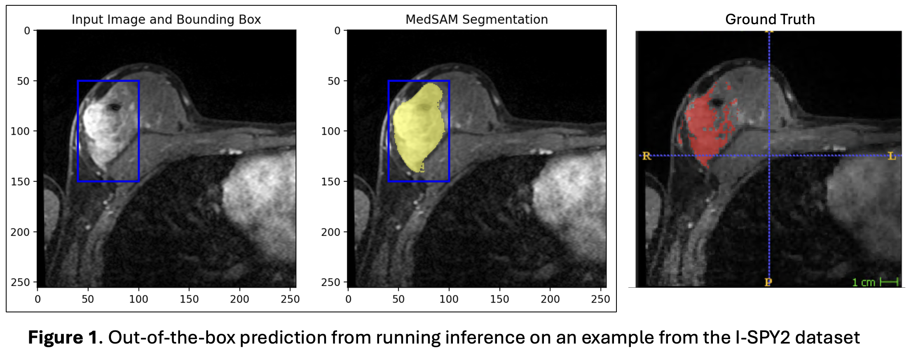
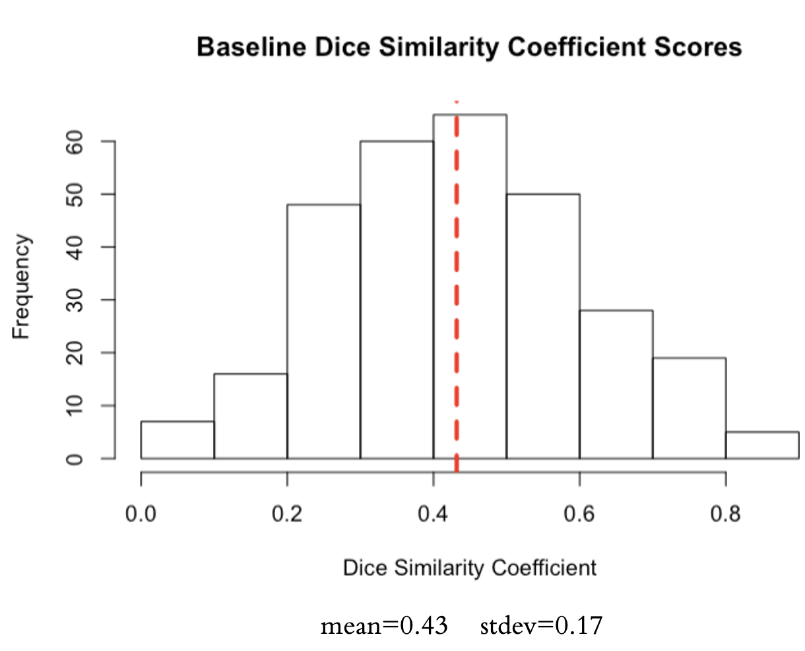
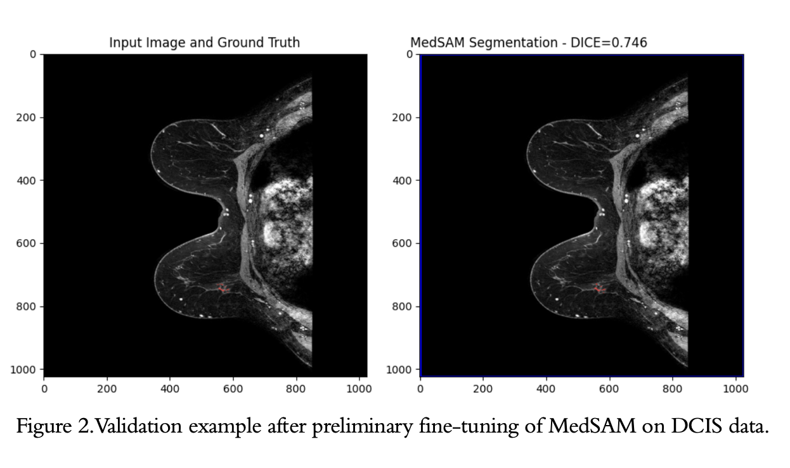

# MedSAM for segmenting breast lesions on MRI

PURPOSE: To fine-tune the MedSAM foundation model by Ma et al. (2024) *Communications* on breast MRI data for segmenting breast lesions. The code under `~/MedSAM` is by the original authors, and all other code in this repository is derivative of this code (https://github.com/bowang-lab/MedSAM)

MOTIVATION: Segmentation remains an important task in medical image analysis for identifying structures of interest, such as cancers, for downstream analysis tasks. Breast cancers are notoriously difficult to segment due to varying enhancement patterns of lesions on dynamic contrast-enhanced MRI and occlusion by dense tissues. Here we aim to evaluate the ability of the MedSAM foundation model to segment breast cancers, specifically ductal carcinoma *in situ* (DCIS) on MRI when fine-tuned on a breast MRI dataset. 

On invasive breast cancer lesions, MedSAM appears to perform well when given an appropriate prompt.

For DCIS, however, with tight bounding boxes around the lesions, the mean dice similarity coefficient is 0.43 (+/-0.17) across the dataset of N=298.

Currently, MedSAM (and SAM) requires a bounding box that identifies the region in which the object of interest lies. This prompt generation, however, still necessitate the involvement of a radiologist to identify breast lesions and delinate bounding boxes for each slice in an imaging volume. To circumvent this step, we are investigating whether MedSAM can be fine-tuned on breast MRI data with a fixed bounding box that includes the entire breast tissue. 

# GETTING STARTED:
1. Clone this git repository and follow the instructions at https://github.com/bowang-lab/MedSAM by the original authors to set up and activate the Conda environment. 
2. Use `~/MedSAM/utils` to preprocess your data with the appropriate script. Alternatively, if you are working with 3D MRI data of DCIS, you can start with `~/Training/utils/convert_3Dto2D.py` and modify it for your needs. 
3. Use `~/MedSAM/utils/split.py` to split your data into training, validation, and testing sets. Alternatively, you can start with `~/Training/utils/split_Data.py`
4. Next, create a config file in `~/configs/` (you can use one of the existing ones as a template). This is where you will input your data paths, set your training parameters, state which layers to unfreeze (see `model_layers.txt` for a list of all model layers),  and configure Weights & Biases. 
5. Finally, run `main.py` (for one GPU) with `python main.py --config /path/to/config`. If you want to do distributed training, start with `~/MedSAM/train_multi_gpus.py` or `~/main_ddp.py`.

PRELIMINARY RESULTS:

*This is a work in progress and is continuously updated*
Preliminary work was done by Kalina Slavkova. Aaron Sossin is a PhD student continuing this work as first-author at the [Computational Imaging Biomarker Group](https://www.columbiaradiology.org/research/research-labs/computational-biomarker-imaging-group-cbig/people) at Columbia University Medical Center

References:
1. Ma et al. (2024). *Communications*. https://doi.org/10.1038/s41467-024-44824-z
2. Kirillov et al. (2023). *arXiv*. https://arxiv.org/abs/2304.02643
